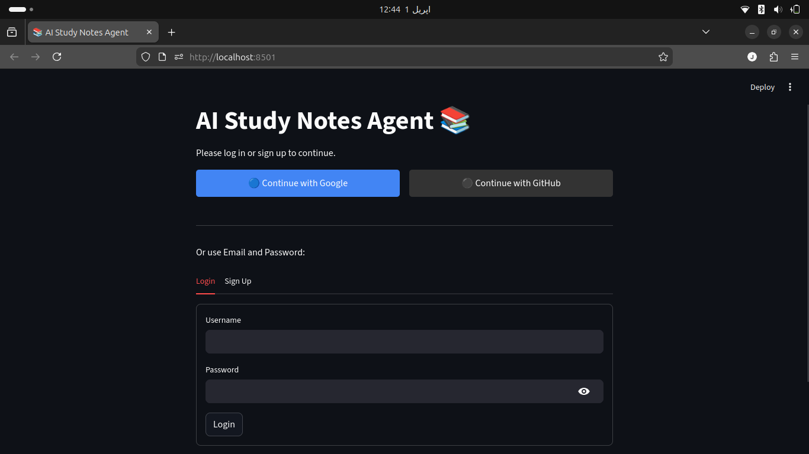
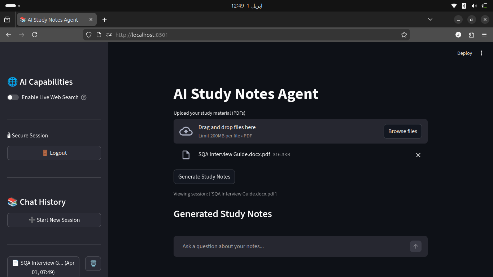
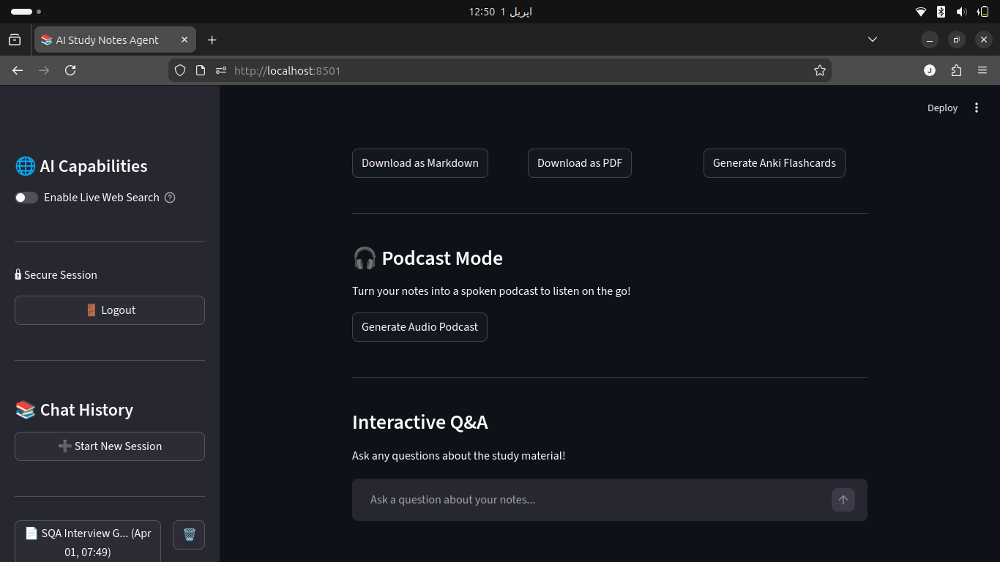
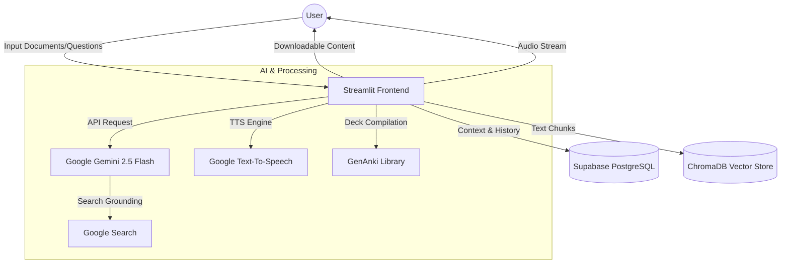

# 📚 AI Study Notes Agent

An enterprise-grade, multi-user AI Study Assistant built locally on Python & Streamlit. This application has drastically evolved from a minimal local PDF reader into a fully-fledged, cloud-native SaaS application utilizing **Google's Gemini 2.5 Flash**, **RAG (Retrieval-Augmented Generation)**, **Search Grounding**, and **Supabase**.

## 📸 Interface Preview

*Showcasing the authentication flow, document pipeline, and dynamic generation options*

  
*Secure authentication supporting Email/Password and OAuth 2.0 (Google/GitHub).*  

  
*Seamlessly upload and index multi-document libraries for intelligent RAG-driven analysis.*  

  
*Tailor your study notes with adjustable tone, focus areas, and detail levels.*  

---

## ✨ Core Features

1. **Intelligent PDF Processing & Notes Generation**: 
   - Upload any academic PDF or Textbook to instantly generate tailored study notes.
   - Customize output by **Tone** (Academic, Beginner), **Focus** (Flashcards, Code Examples), and **Length**.

2. **Full Library RAG Pipeline (ChromaDB + LangChain)**:
   - Upload multiple PDFs to seamlessly build a persistent study library! 
   - Uses `gemini-embedding-001` paired with **ChromaDB** to securely slice and embed chapters mathematically, allowing the AI to cite specific textbook pages instantly via Semantic Search.

3. **Interactive Q&A Chat & Live Web Search 🌐**:
   - Chat natively with the LLM about your textbooks below the reading notes. 
   - When the **Live Web Search** toggle is enabled, the agent dynamically bridges Google's enterprise **Search Grounding APIs** into your chat, merging your local textbook context securely with real-time internet data!

4. **1-Click Anki Spaced-Repetition Deck Generator 🗃️**:
   - Integrated with the robust `genanki` Python library.
   - The AI uses a strict extraction pipeline to rip out factual data from your notes into pairs, injects them seamlessly into a native SQLite database, and hands you an `.apkg` file directly to double-click and import straight into Desktop Anki Software.

5. **Podcast Mode 🎧**:
   - Seamlessly converts Markdown notes into an accessible spoken podcast natively in the browser leveraging `gTTS` (Google Text-To-Speech).

6. **Cloud Database Architecture ☁️**:
   - Native Python backend hooked dynamically to a remote **Supabase (PostgreSQL)** database.
   - Supports fully encrypted `bcrypt` Email/Password Authentication out of the box.
   - Saves every single chat session, uploaded document payload, and interaction strictly against your specific User UUID, persisting natively across multiple computers instantly.

7. **OAuth 2.0 Integration**:
   - Log in effortlessly using native deep-links via **"Continue with Google"** and **"Continue with Github"**.

## 📁 Project Structure

```text
.
├── app.py              # Main Entry Point (Streamlit)
├── src/
│   ├── core/           # Agent Logic, RAG, Prompts
│   ├── database/       # Supabase Client & Operations
│   ├── auth/           # OAuth 2.0 (Google/GitHub)
│   ├── ui/             # Modular Streamlit UI Components
│   ├── exporters/      # PDF, Anki, & Audio Generation
│   └── utils/          # PDF Reader & Utility Helpers
├── tests/              # Test Scripts & Debug Utilities
├── requirements.txt    # Python Dependencies
└── .env                # Secret Keys (Not for GitHub!)
```

## 🏗️ System Architecture



## 🛠️ Installation & Setup

Ensure you have Python 3.10+ installed.

1. **Clone & Virtual Environment:**
```bash
git clone [https://github.com/your-username/ai-study-notes-agent.git](https://github.com/your-username/ai-study-notes-agent.git)
cd ai-study-notes-agent
python -m venv venv
source venv/bin/activate
```

2. **Install Dependencies:**
```bash
pip install -r requirements.txt
```

3. **Configure Environment Variables:**
Create a `.env` file literally natively inside the root folder matching exactly this blueprint:

```env
# Google AI API Key
GEMINI_API_KEY=your_gemini_api_key

# Supabase Postgres Deployment
SUPABASE_URL=your_supabase_project_url
SUPABASE_KEY=your_supabase_anon_public_key

# Optional OAuth APIs
GOOGLE_CLIENT_ID=your_google_oauth_client_id
GOOGLE_CLIENT_SECRET=your_google_oauth_secret
GITHUB_CLIENT_ID=your_github_oauth_client_id
GITHUB_CLIENT_SECRET=your_github_oauth_secret
```

4. **Initialize Supabase Datastore:**
You absolutely must execute this SQL block dynamically in your Supabase SQL Editor:
```sql
CREATE TABLE users (
  id UUID PRIMARY KEY DEFAULT uuid_generate_v4(),
  email TEXT UNIQUE NOT NULL,
  password_hash TEXT,
  provider TEXT DEFAULT 'email',
  created_at TIMESTAMP WITH TIME ZONE DEFAULT NOW()
);

CREATE TABLE sessions (
  id UUID PRIMARY KEY DEFAULT uuid_generate_v4(),
  user_id UUID REFERENCES users(id) ON DELETE CASCADE,
  filename TEXT NOT NULL,
  pdf_text TEXT,
  notes TEXT,
  chat_history JSONB DEFAULT '[]'::jsonb,
  timestamp TIMESTAMP WITH TIME ZONE DEFAULT NOW()
);

ALTER TABLE users DISABLE ROW LEVEL SECURITY;
ALTER TABLE sessions DISABLE ROW LEVEL SECURITY;
```

5. **Launch Application:**
```bash
source venv/bin/activate  # (Use .\venv\Scripts\activate on Windows)
streamlit run app.py
```

## 💻 Tech Stack
- Frontend Framework: `Streamlit`
- AI/LLM Provider: `google-genai` (Gemini 2.5 Flash + Search Grounding tools)
- Database: `Supabase` / `PostgreSQL`
- Vector DB (RAG): `ChromaDB`, `LangChain Text Splitters`
- External Integrations: `gTTS` (Audio Podcasts), `GenAnki` (Spaced Repetition Flashcards), `bcrypt` (Security), `python-dotenv` (Environments)
- Note Processing: `PyPDF2`, `Markdown`, `FPDF`

## 📄 License

This project is licensed under the MIT License - see the [LICENSE](LICENSE) file for details.
