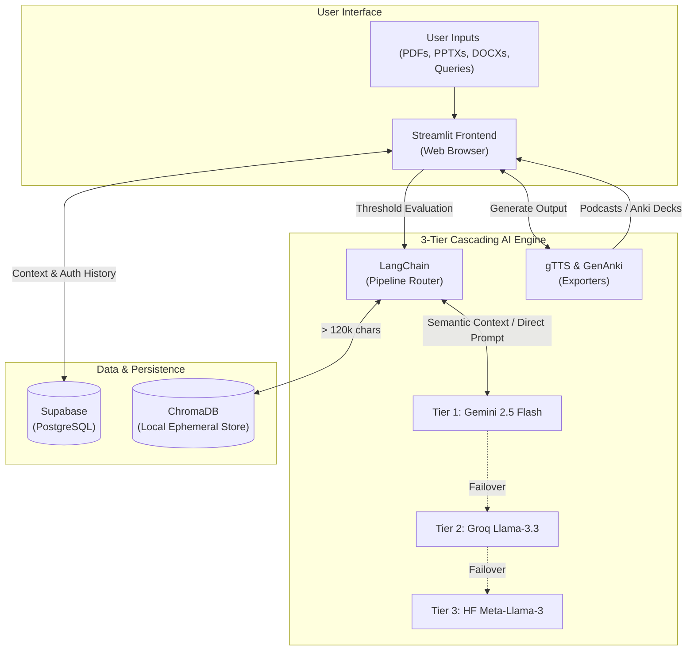

# AI Study Notes Agent 📚
### Enterprise-Grade Multi-User AI Study Assistant

<p align="center">
  
  
  
  
  
  
  
  
  
  
  
  
</p>

---

An enterprise-grade, multi-user AI Study Assistant built locally on Python & Streamlit. This application leverages a dynamic multi-tier LLM cascade and intelligent document routing to transform how users digest and interact with academic materials. It ensures zero-downtime service via seamless failovers across Google Gemini, Groq, and Hugging Face infrastructure.

---

## 📸 Interface Preview

*Showcasing the authentication flow, document pipeline, and dynamic generation options*

<p align="center">
  
  
  
</p>
*From left to right: Secure authentication, seamless multi-document uploads, and deep customization options.*

---

## 💻 Tech Stack

**Frontend & Core Framework**
* **Framework:** Streamlit
* **Language:** Python 3.10+
* **Audio Generation:** gTTS (Google Text-To-Speech)
* **Flashcard Compilation:** GenAnki

**Backend & Data Layer**
* **Relational Database & Auth:** Supabase (PostgreSQL)
* **Vector Database:** ChromaDB
* **Data Pipelines:** LangChain Text Splitters, `python-docx`, `python-pptx`, PyPDF2
* **Security:** bcrypt, OAuth 2.0 (GitHub)

**AI & Inference**
* **Core Reasoning Engine (Tier 1):** Google Gemini 2.5 Flash (`google-genai`)
* **Secondary Fallback Engine (Tier 2):** Groq API (`llama-3.3-70b-versatile`)
* **Tertiary Fallback Engine (Tier 3):** Hugging Face Serverless API (`meta-llama/Meta-Llama-3-70B-Instruct`)
* **Vision & OCR Pipeline:** Gemini 2.5 Flash with fallback to Groq `llama-3.2-11b-vision-preview` (powered by `pdf2image` and `Pillow`)
* **Vector Embeddings:** `gemini-embedding-001`
* **Real-time Data Fetching:** Google Search Grounding API

---

## 🌐 System Architecture

The AI Study Notes Agent utilizes a local processing engine seamlessly connected to cloud-based persistence and state-of-the-art AI inference pipelines.

### System Diagram



### Component Breakdown

**`Frontend` — Streamlit UI Engine**
A dynamic, Python-driven user interface managing real-time chat interactions, document uploads, and complex layout configurations securely inside the user's browser.

**`Data Layer` — Supabase & ChromaDB**
Supabase acts as the remote source of truth for user sessions, saving chat histories and document metadata securely with Row Level Security (RLS). ChromaDB operates dynamically: smaller files bypass it completely, while large files deploy an ultra-fast ephemeral vector indexer for real-time document semantic search.

**`Inference` — 3-Tier Cascading Engine & Grounding**
Powers the intelligence of the application with absolute zero downtime. Gemini 2.5 Flash acts as the primary orchestrator to synthesize study notes. If rate limits or outages occur, the system automatically falls back to Groq and Hugging Face.

---

## ✨ Core Features & AI Pipeline

| Feature | Description |
|-------|-------------|
| **Universal Ingestion Engine** | Upload academic PDFs, Word Docs (.docx), PowerPoints (.pptx), Images (.png, .jpg), and Text files to instantly generate tailored study notes. Features an advanced LLM Vision cascade and smart fallback OCR for scanned documents! |
| **Smart Pipeline Routing** | Evaluates document length dynamically. Files < 120k characters bypass vectorization directly to the LLM context. Larger files trigger chunking into an ephemeral **ChromaDB** RAG index. |
| **High-Availability LLM Cascade** | Guarantees zero downtime. The backend automatically catches connection/rate limit errors on Google Gemini and cascades the generation request to Groq, and then to Hugging Face if needed. |
| **Interactive Q&A & Web Search 🌐** | Chat natively with the LLM about your textbooks. Live Web Search dynamically bridges Google's enterprise **Search Grounding APIs** into your chat. |
| **1-Click Anki Generator 🗃️** | AI extracts factual data from your notes, injecting pairs seamlessly into an SQLite database via `genanki`, handing you an `.apkg` file directly to import into Desktop Anki Software. |
| **Podcast Mode 🎧** | Seamlessly converts Markdown notes into an accessible spoken podcast natively in the browser leveraging `gTTS` (Google Text-To-Speech). |
| **Cloud DB & OAuth 2.0 ☁️** | Hooked dynamically to a remote **Supabase (PostgreSQL)** database. Log in via Email/Password or **Github** OAuth. |
| **Robust Security Setup 🛡️** | Hardened authentication with implicit login and rate-limiting lockouts. Features a robust 3-layer **Prompt Guard** (Regex Pattern Filter, Groq LLM Classifier, System Prompt Hardening) to block prompt injections, exfiltration, and off-topic abuse. |

---

## 🛠️ Installation & Setup

Ensure you have Python 3.10+ installed.

### 1. Clone & Virtual Environment
```bash
git clone https://github.com/your-username/ai-study-notes-agent.git
cd ai-study-notes-agent
python -m venv venv
source venv/bin/activate
```

### 2. Install Dependencies
```bash
pip install -r requirements.txt
```

### 3. Configure Environment Variables
Create a `.env` file inside the root folder matching this exact blueprint:

```env
# Google AI API Key
GEMINI_API_KEY=your_gemini_api_key

# Supabase Postgres Deployment
SUPABASE_URL=your_supabase_project_url
SUPABASE_KEY=your_supabase_anon_public_key

# OAuth APIs
GITHUB_CLIENT_ID=your_github_oauth_client_id
GITHUB_CLIENT_SECRET=your_github_oauth_secret

# LLM Fallback Provider Keys
GROQ_API_KEY=your_groq_api_key
HUGGINGFACE_API_KEY=your_huggingface_api_key
```

### 4. Initialize Supabase Datastore
You must execute this SQL block in your Supabase SQL Editor:
```sql
CREATE TABLE users (
  id UUID PRIMARY KEY DEFAULT uuid_generate_v4(),
  email TEXT UNIQUE NOT NULL,
  password_hash TEXT,
  provider TEXT DEFAULT 'email',
  created_at TIMESTAMP WITH TIME ZONE DEFAULT NOW()
);

CREATE TABLE sessions (
  id UUID PRIMARY KEY DEFAULT uuid_generate_v4(),
  user_id UUID REFERENCES users(id) ON DELETE CASCADE,
  filename TEXT NOT NULL,
  pdf_text TEXT,
  notes TEXT,
  chat_history JSONB DEFAULT '[]'::jsonb,
  timestamp TIMESTAMP WITH TIME ZONE DEFAULT NOW()
);

-- Note: Ensure strict Row Level Security (RLS) policies are active in production.
ALTER TABLE users ENABLE ROW LEVEL SECURITY;
ALTER TABLE sessions ENABLE ROW LEVEL SECURITY;
```

### 5. Launch Application
```bash
source venv/bin/activate  # (Use .\venv\Scripts\activate on Windows)
streamlit run app.py
```

---

## 🚀 CI/CD & Deployment Guide (Hugging Face Spaces)

This project is fully dockerized and features a complete GitHub Actions CI/CD pipeline for seamless production deployment on Hugging Face Spaces.

1. Create a new Space on Hugging Face and select the **Docker** environment template.
2. In your GitHub repository, configure your Hugging Face Access Token as a Secret named `HF_TOKEN`.
3. Ensure `.github/workflows/deploy_hf.yml` points to your exact Hugging Face Space ID.
4. Any pushes to the `main` branch will automatically sync and trigger a rebuild on Hugging Face Spaces!
5. Configure your Space **Secrets** with all the environment variables defined in the `.env` template above. 
6. Hugging Face will automatically construct the container using the provided `Dockerfile`. Note: `chroma_db/` is ephemeral by design, so no persistent volume configuration is required.

---

## 📁 Project Directory Map

```text
ai-study-notes-agent/
├── .github/workflows/  # Automated CI/CD Pipelines
├── app.py              # Main Entry Point (Streamlit)
├── requirements.txt    # Python Dependencies
├── .env                # Secret Keys (Not tracked)
├── src/
│   ├── core/           # Agent Logic, Pipeline Router, LLM Cascade, Vision Client
│   ├── database/       # Supabase Client & Operations
│   ├── security/       # 3-Layer Prompt Guard & Attack Mitigation
│   ├── auth/           # OAuth 2.0 (GitHub)
│   ├── ui/             # Modular Streamlit UI Components
│   ├── exporters/      # PDF, Anki, & Audio Generation
│   └── utils/          # Universal Extraction Engine (PDF, DOCX, PPTX)
└── tests/              # Test Scripts & Debug Utilities
```

---

<p align="center">Built with ❤️ for intelligent, local-first learning dynamics.</p>

---

## 📄 License

<details>
<summary>MIT License — click to expand</summary>

```text
MIT License

Copyright (c) 2025 AI Study Notes Agent

Permission is hereby granted, free of charge, to any person obtaining a copy
of this software and associated documentation files (the "Software"), to deal
in the Software without restriction, including without limitation the rights
to use, copy, modify, merge, publish, distribute, sublicense, and/or sell
copies of the Software, and to permit persons to whom the Software is
furnished to do so, subject to the following conditions:

The above copyright notice and this permission notice shall be included in all
copies or substantial portions of the Software.

THE SOFTWARE IS PROVIDED "AS IS", WITHOUT WARRANTY OF ANY KIND, EXPRESS OR
IMPLIED, INCLUDING BUT NOT LIMITED TO THE WARRANTIES OF MERCHANTABILITY,
FITNESS FOR A PARTICULAR PURPOSE AND NONINFRINGEMENT. IN NO EVENT SHALL THE
AUTHORS OR COPYRIGHT HOLDERS BE LIABLE FOR ANY CLAIM, DAMAGES OR OTHER
LIABILITY, WHETHER IN AN ACTION OF CONTRACT, TORT OR OTHERWISE, ARISING FROM,
OUT OF OR IN CONNECTION WITH THE SOFTWARE OR THE USE OR OTHER DEALINGS IN THE
SOFTWARE.
```

</details>
